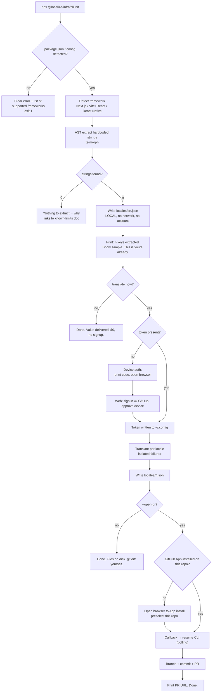
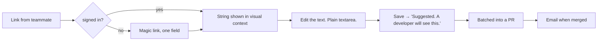

# UX & User Flows

Date: 2026-08-06
Depends on: `01-prd.md`

---

## 0. The governing UX decision

Most competitors have one primary surface: a web app you log into. **We have three surfaces with an explicit hierarchy**, and getting this hierarchy right is the whole design.

| Rank | Surface | Owner | Job |
|---|---|---|---|
| 1 | **Terminal** | Maya (P1) | Everything a developer does. Fast, scriptable, no login for local work. |
| 2 | **The pull request** | everyone | Where review actually happens. GitHub is the review UI; we do not rebuild it. |
| 3 | **Web app** | Inès (P3), Wolfgang (P4), Tomás (P2) | Only the three jobs 1 and 2 genuinely cannot do. |

**The web app exists for exactly three jobs.** If a proposed screen is not one of these, it does not get built:

- **J1 — Resolve ambiguity.** Requires holding visual context, screenshot, and options simultaneously. A terminal cannot do this well; a PR comment thread does it terribly.
- **J2 — Let a non-developer change a word.** Inès will never run `npx`, and asking her to edit a JSON file in the GitHub web editor is a joke.
- **J3 — Administrative truth.** Billing, members, audit, tokens, sub-processors. Nobody wants this in a terminal, and it cannot live in a repo.

Everything else — status, history, diffs, approvals — **already has a better home in Git or GitHub**, and duplicating it is how we become the bloated incumbent we are trying to replace.

> Design rule invoked throughout: *if GitHub already renders it well, we link to it; we do not re-render it.*

---

## 1. Flow A — First run (Maya, cold start)

The single most important flow in the product. Target: **< 3 minutes, zero account required to see value.**



**Design decisions and why:**

1. **Extraction happens before any auth, and writes a real file.** The user gets a durable artifact — `locales/en.json`, theirs forever — before we ask for anything. This directly answers PR6 (setup cost exceeds pain). It is also the honest embodiment of "cancel and keep everything": the very first interaction proves the claim.
2. **Device-code auth, not a signup wall.** Pattern borrowed from `gh`, Vercel, Stripe CLIs: the terminal prints a short code, opens the browser, the user approves, the terminal continues. Never ask Maya to invent a password.
3. **GitHub App install is deferred to the moment it is needed**, with the target repo preselected. We learned in live validation (Task 6) that an install scoped to "selected repositories" silently lacks access to a new repo — so the CLI must **detect that specific failure and deep-link to the install-configuration page**, not print a raw 403.
4. **Every step is independently useful.** Stop after extraction: useful. Stop after translation: useful. This makes abandonment non-fatal and is why there is no progress-bar-shaped funnel.

**Error states, all of which must name the fix:**

| Condition | Message | Recovery |
|---|---|---|
| No framework | lists the 3 supported + link | — |
| No token | device-auth prompt | inline |
| App not installed | deep link, repo preselected | inline |
| App lacks *this* repo | deep link to install **config** page | inline (learned from Task 6) |
| One locale fails | per-locale `FAILED — reason`; others proceed | already built |
| All locales fail | "no PR opened, nothing to include" + per-locale reasons | already built |
| Would drop existing keys | refuses; requires `--force`; names count | already built |
| Rate limited | plain-English + retry-after | — |

---

## 2. Flow B — Landing page → first command

Goal: get to the terminal, fast. **The landing page's success metric is `npx` runs, not signups.**

**Above the fold.** One sentence of positioning, and the command, copyable in one click:

```
npx @localize-infra/cli init
```

No "Book a demo." No email gate. No signup CTA competing with the command. A single secondary link — "see a real PR" — pointing at an actual merged PR in a public repo, which is a proof artifact competitors cannot fake.

**Below the fold, in order, each section answering the objection that arises at that scroll depth:**

1. **The PR itself** — a real rendered diff. Show, do not tell.
2. **"Cancel and keep everything"** — the ownership claim with the `git pull` demo.
3. **"It tells you when it doesn't know"** — an ambiguity item, verbatim, with the escalation. *This is the section competitors cannot copy.*
4. **Pricing, in full, on the landing page** — flat, with the explicit "we never count words, keys, characters, or seats" pledge. Given Phrase and Lokalise just repriced their customers, this section is a conversion weapon; hiding pricing would waste it.
5. **Published benchmarks, including losses** — link to live per-language results.
6. **Sub-processors & data residency** — because P5 exists and a public answer removes a sales call.

**Anti-patterns explicitly banned:** rotating hero carousel; "trusted by" logo wall we have not earned; fake urgency; chat widget that opens itself; any animation that delays the command becoming copyable.

---

## 3. Flow C — Authentication

**Three entry points, one identity.**

| Entry | Mechanism | Notes |
|---|---|---|
| CLI | device code → browser → approve | primary |
| Web (Maya/Tomás) | Sign in with GitHub (OAuth) | primary |
| Web (Inès/Wolfgang) | **magic link** | P3/P4 may not have GitHub accounts, and requiring one would kill J2 |
| Enterprise | SAML SSO + SCIM | Scale tier |

**Decision: GitHub OAuth is the default, but must not be the only option.** Requiring GitHub for a marketer to fix one German word defeats the entire non-dev review thesis. Magic-link accounts are second-class by design — they can review and comment, never administer.

Sessions: short-lived access + refresh; revocable per-device from Settings → Sessions. Every device-auth grant is listed with last-used and revoke.

---

## 4. Flow D — Onboarding (web), after first CLI success

We deliberately onboard *second*. The user arrives having already succeeded in the terminal, which inverts the usual "wizard then value" order into "value then context."

Three steps, all skippable, progress never blocking:

1. **Confirm project** — we already know the repo from the CLI run. Confirm, do not ask.
2. **Choose active locales** — the one setting that maps to price. Honest and upfront.
3. **Invite the person who will notice bad copy** — an Inès invite. This is the growth mechanic, placed at the moment of highest goodwill.

**No product tour. No checklist gamification.** Maya finds these insulting, and she is the one who got here.

---

## 5. Flow E — Ambiguity queue (J1) — *the differentiating screen*

This is the product's reason to exist as a UI. It is a **throughput instrument**, designed like Superhuman/Linear triage, not like a form.

**The screen holds four things simultaneously**, which is why it cannot be a terminal or a PR comment:
- the source string
- **why** the agent escalated (the specific ambiguity)
- the visual context (component screenshot from M3, file path, surrounding code)
- the candidate resolutions

**Interaction model — one decision per keystroke:**

| Key | Action |
|---|---|
| `1`–`9` | pick that option, advance immediately |
| `E` | write your own, advance on Enter |
| `C` | add clarifying context for future runs (does not resolve) |
| `S` | skip, stays in queue |
| `⌘Z` | undo last decision (must exist — throughput tools need forgiveness) |
| `J`/`K` `↑`/`↓` | move without deciding |
| `⌘K` | command palette |

**Non-negotiable behavioral rule, straight from the roadmap's own M4 exit criterion:** *a decision taken once must never be asked again.* The decision is persisted and applied to future runs. Violating this destroys the entire value of the screen.

**Empty state is the aspirational state**, and must be celebratory rather than apologetic: "Nothing ambiguous. 1,204 strings translated with confidence." With a link to the benchmark page. An empty ambiguity queue means the system is working.

**Anti-goal:** this must not become a CAT editor. It resolves *ambiguity*, not translation quality generally. If a user wants to edit every string, they are in the wrong tool and we should say so.

---

## 6. Flow F — Non-developer review (J2)

Inès receives a link (Slack, email, PR comment). She must be able to act with **no account setup, no GitHub, no vocabulary.**



**Vocabulary rules for this surface — enforced in copy review:**

| Never show | Show instead |
|---|---|
| key, `src.App.welcome` | the English text |
| file path, JSON, YAML | the screen it appears on |
| branch, commit, merge conflict | "waiting for a developer" |
| pull request | "sent for approval" |
| locale code `pt-BR` | "Portuguese (Brazil)" |

**Her changes are suggestions, never direct writes.** Git remains the source of truth and a developer remains in the loop — which preserves invariant #1 and, more practically, prevents a marketer from shipping a syntax error into production.

---

## 7. Flow G — Repository connection & GitHub App

Learned directly from live validation (Task 6), where this exact flow broke:

1. Install App → GitHub consent → callback stores installation ID per account.
2. **Handle "selected repositories" scope explicitly.** If the App is installed but lacks *this* repo, that is a distinct state with a distinct fix (configure install), not a generic error. This bit us in real testing and will bite every user.
3. Multiple installations per account (personal + org).
4. Show, per repo: connected / not connected / **installed-but-not-authorized**.
5. Handle revocation mid-run gracefully.

---

## 8. Flow H — Billing

**The billing page is a marketing asset**, because our pricing is the product claim. It must state, on the page: *"We do not count words, characters, keys, or seats. Your bill does not change when your product grows."*

- Plan selection, flat prices, no calculator, no estimator, **no usage meter anywhere** (a meter is a billable counter waiting for a revenue crisis).
- Only two things affect price: number of private projects, number of active locales. Both are shown as *settings*, never as consumption.
- Upgrade/downgrade self-serve at every tier below Enterprise. Given competitors just put tiers behind "Book a demo," self-serve at $399 is itself a differentiator.
- Invoice history, tax ID, card management — Stripe-hosted where possible; less surface, less liability.

---

## 9. Remaining surfaces, with justification for existing

| Surface | Job | Verdict |
|---|---|---|
| **Dashboard (home)** | answer "is anything waiting for me?" | **Thin by design.** Ambiguity count, recent PRs, failing locales. Not an analytics dashboard. Zero vanity metrics. |
| **Projects list** | switch context | Needed once >1 project. |
| **Project overview** | locales, health, recent runs | Links out to GitHub for diffs. |
| **History / runs** | debug "what happened in that run" | Per-run log, per-locale outcome, PR link. Justified: this data exists nowhere else. |
| **Members / roles** | J3 | Owner/Admin/Developer/Reviewer/Billing. |
| **Organizations** | J3 | Only when a second project or third member appears — never in v1 onboarding. |
| **API keys** | CLI/CI tokens | Scoped, revocable, last-used, **shown once**. |
| **Logs / audit** | enterprise + debugging | Append-only, exportable, filterable. |
| **Notifications** | ambiguity waiting, run failed, PR merged | Email + optional Slack. In-app bell only if it earns it. |
| **Settings** | project, org, personal | Three clearly separated scopes. |
| **Profile** | name, email, sessions, devices | Session revocation matters (device auth). |
| **Help** | docs, sub-processors, benchmarks, status | Public, no login, indexable — technical SEO is an acquisition channel. |
| **Benchmarks (public)** | trust | **Includes losses.** Unique. |
| **Search / ⌘K** | navigation | See §10. |

---

## 10. Command palette (⌘K)

Available on every authenticated screen. It is not a novelty; for Maya it is the primary navigation and it lets us keep the sidebar small.

Scopes: navigation, projects, actions ("open ambiguity queue", "invite member", "copy CLI token"), search (strings, runs, members), help. Recent items first, fuzzy matched. Type-ahead with `>` for actions and `#` for projects.

**Global shortcuts:** `⌘K` palette · `G then P` projects · `G then A` ambiguity · `G then S` settings · `?` shortcut sheet · `Esc` close. Shortcuts are discoverable via `?` and shown inline in menus, never hidden.

---

## 11. System states

Applied uniformly. These are the states that separate a real product from a demo.

**Loading.** Skeletons that match final layout (no spinners for content, no layout shift). Optimistic UI on ambiguity decisions — the decision is local-first, reconciled after; a throughput tool cannot wait for a round trip.

**Empty.** Every empty state names the next action and, where relevant, is *positive*: no ambiguity = success, not emptiness. No project = show the `npx` command, not a "Create project" button, because the CLI is the real entry point.

**Error.** Three tiers: inline field, section-level (retry in place), page-level (what broke, what to do, what we already know). Never a raw stack trace, never a bare code. Every error names a recovery. Rate limits and provider outages get plain-English explanations with a status-page link.

**Success.** Quiet. A merged PR is the real success signal and it happens in GitHub. Toasts are brief, non-blocking, and never confirm the obvious.

**Offline.** Read-only cached view with a clear banner; queued ambiguity decisions replay on reconnect (they are the one write worth queueing).

**Destructive.** Type-to-confirm for project deletion, App uninstall, member removal. And a specific, unusual one: **"Delete account" must show what the user keeps** — their repo, their translations — because that is the product's central promise and this is the moment it is proven.

---

## 12. Responsive

| Breakpoint | Behavior |
|---|---|
| ≥1280 | full: persistent sidebar, ambiguity queue with side-by-side context |
| 1024–1279 | sidebar collapses to icons |
| 768–1023 | sidebar → sheet; ambiguity context stacks above options |
| <768 | **Mobile is review-only, and that is a deliberate scope decision.** Inès approving a string on a phone: yes. Maya administering an org on a phone: no. Admin screens degrade to a readable, honest "open on desktop" rather than a cramped unusable form. |

---

## 13. Accessibility (WCAG 2.2 AA, treated as a floor)

Non-negotiable, and unusually load-bearing here: this is a product about language access, and P4's entire workflow is keyboard-only.

- **Keyboard-complete.** Every action reachable without a mouse; visible focus rings everywhere; logical tab order; no keyboard traps. The ambiguity queue is keyboard-*first*, not merely keyboard-accessible.
- Contrast ≥ 4.5:1 body, ≥ 3:1 large/UI. Verified per token pair, not eyeballed.
- Never color alone to signal state (failed locale, ambiguity severity) — always icon + text.
- Screen readers: correct landmarks, live regions for async results, labelled controls, dialogs that trap and restore focus.
- `prefers-reduced-motion` honored globally — all non-essential motion off, no parallax, no scroll-jacking.
- **RTL support in our own UI**, not just in output. We ship Arabic; a broken RTL layout in a localization product is disqualifying.
- Target sizes ≥ 24×24 (WCAG 2.2 AA), ≥ 44×44 on touch.
- Our own product localized into the languages we sell.

---

## 14. Deliberately excluded

Recorded so they are not silently re-added:

- **A diff viewer.** GitHub's is better and already in the workflow.
- **In-app PR approval.** Approving code changes outside GitHub's permission model is a security anti-pattern.
- **A CAT editor.** Non-goal (PRD §10).
- **Real-time collaborative editing.** Enormous cost; Git already resolves it.
- **Analytics dashboards** (words translated, activity graphs). These are the vanity surface that leads directly to a usage meter — banned by invariant #3.
- **In-app chat support widget.** Docs + email. A widget on a developer tool signals the docs failed.
